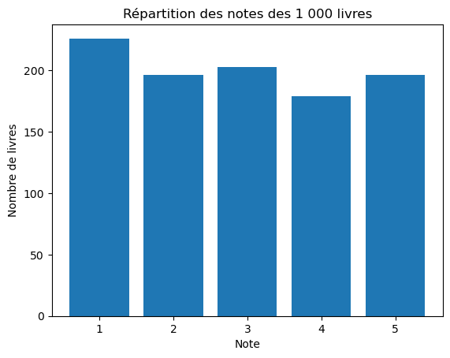
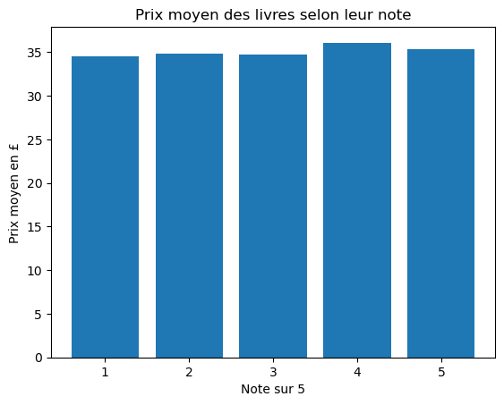

# 🌐 Web-scraping-books-analysis

## 🎯 Présentation

Ce projet Python automatise la récupération et l'analyse des données du catalogue
Books to Scrape, un site conçu pour s'entraîner au web scraping.

Le programme parcourt automatiquement 50 pages et récupère les informations
de 1 000 livres :
- titre
- prix
- note sur 5

Les données sont ensuite nettoyées, analysées et visualisées.

## 🛠️ Technologies utilisées

**Langage**
- Python

**Bibliothèques**
- Requests
- BeautifulSoup
- Pandas
- Matplotlib

## 🔎 Fonctionnement

1. Parcours automatique des 50 pages du catalogue
2. Extraction du titre, du prix et de la note de chaque livre
3. Stockage des 1 000 résultats
4. Création d'un DataFrame Pandas
5. Nettoyage et conversion des données
6. Analyse statistique
7. Création de visualisations
8. Export des données au format CSV

## 📊 Résultats

- Livres analysés : **1 000**
- Prix moyen : **35,07 £**
- Prix minimum : **10,00 £**
- Prix maximum : **59,99 £**
- Note moyenne : **2,92 / 5**

### ⭐ Répartition des notes

### 💷 Prix moyen selon la note

## 💡 Conclusion

L'analyse montre que les prix moyens restent relativement proches quelle que
soit la note attribuée aux livres. Sur ce jeu de données, aucune relation
évidente n'apparaît donc entre le prix et la note.

Ce projet m'a permis de mettre en pratique le web scraping, l'automatisation,
le nettoyage de données, l'analyse avec Pandas et la visualisation avec
Matplotlib.
